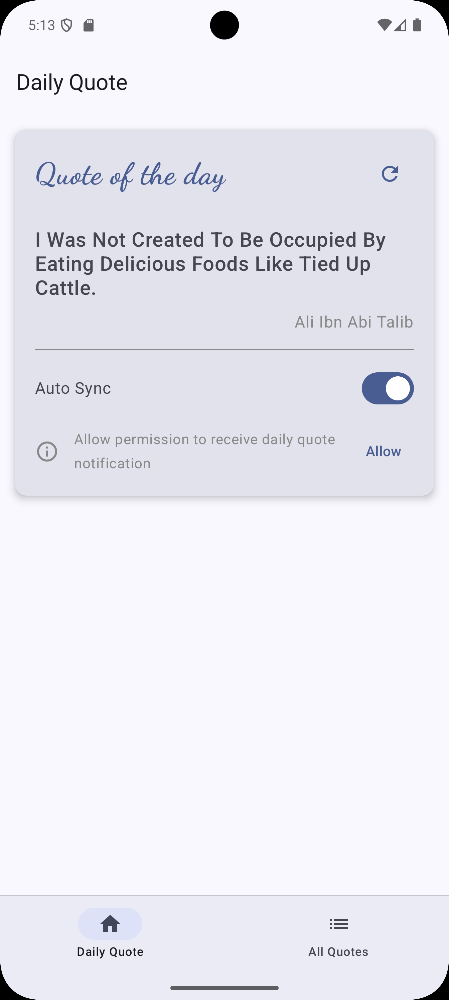
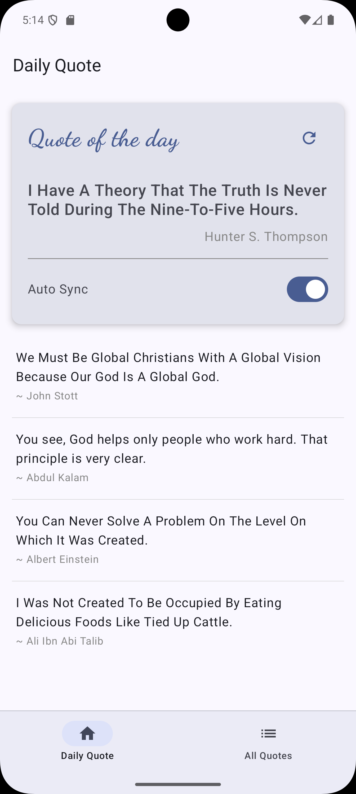
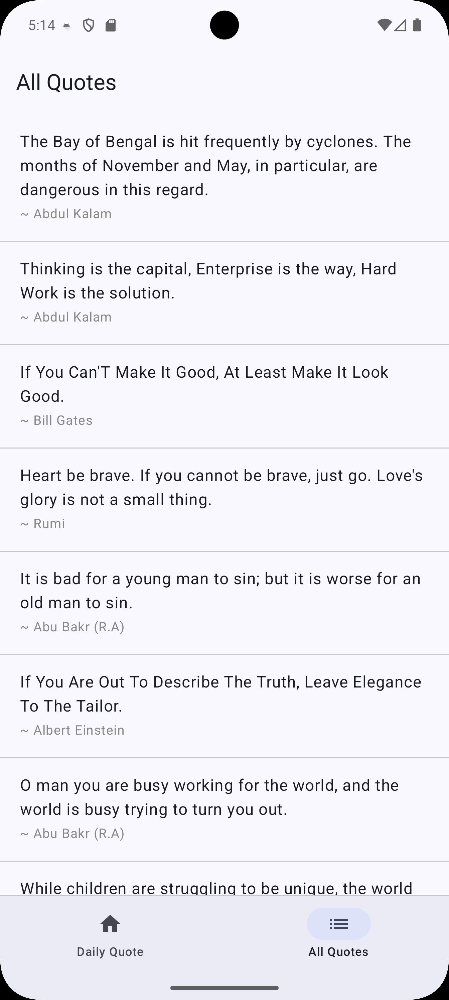

---

# 📖 DailyQuote – Kotlin Jetpack Compose Tutorial

**DailyQuote** is a sample Android application built with **Jetpack Compose** that demonstrates **modern Android development practices** using clean code and real-world libraries.

This project is designed as a **learning-focused tutorial** for developers who want to understand how to build **offline-first + online-paginated apps** using **Jetpack Compose** and **StateFlow**.

---

## 🖼 Screenshots

    
  
  

---

## 🚀 What You’ll Learn From This Project

This project covers **end-to-end app development concepts**, including:

- Jetpack Compose UI
- State & Event handling using **StateFlow**
- Clean Architecture (UI → ViewModel → UseCase → Repository)
- Offline-first approach with **Room Database**
- Online pagination using **Compose Paging Library**
- Dependency Injection with **Hilt**
- Networking using **Retrofit**
- Background sync using **WorkManager**
- Local Push Notifications
- Asking & handling **Notification Permission** in Jetpack Compose
- Managing **manual + automatic data sync**

---

## 🧱 Tech Stack

- Kotlin
- Jetpack Compose
- StateFlow
- Room Database
- Retrofit
- Hilt (Dependency Injection)
- WorkManager
- Paging 3 (Compose Paging)
- Local Notifications

---

## 📱 App Overview

The app contains **two main screens**:

### 1️⃣ Daily Quote Screen

- Fetches one quote from server
- Displays the latest quote
- Saves quote to Room database
- Shows previously downloaded quotes
- Manual refresh
- Auto-sync using WorkManager

### 2️⃣ All Quotes Screen

- Live data from server
- Pagination using Paging Compose
- Proper loading & error handling

---

## 🔄 Architecture

UI → ViewModel (StateFlow) → Repository → Room / Retrofit

---

## 🔔 Notifications & Permissions

- Request notification permission (Android 13+)
- Handle permission in Jetpack Compose
- Show local notification after background sync

---

## 🛠 How to Run

1. Clone repository
2. Open in Android Studio
3. Sync Gradle
4. Run on device/emulator

---

## 📄 License

Free to use for learning purposes.
